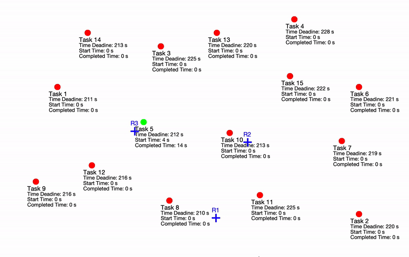

Learning Scalable Policies over Graphs for Multi-Robot Task Allocation using Capsule Attention Networks
(CapAM)

This repository contains the code for the implementation of Capsule based attention networks, for solving Multi-Robot Task Allocation.
It also has the baseline AM-RL implementation as well.

How to use the code:

    Training:

    Evaluation:
        The datasets for testing can be found inside the directory named 'data'

Dependencies:
    The code is written in Python. We recommend using Python 3.7. The required packages can be found in the file requirements.txt.

Citation:

    Please cite our work if you find it useful.

    Paul, S., Ghassemi, P.,  and Chowdhury, S., Learning Scalable Policies over Graphs for Multi-Robot Task Allocation using Capsule Attention Networks , IEEE International Conference on Robotics and Automation (ICRA 2022), May 23-27, 2022, Philadelphia, PA. (accepted)
    
    Bibtex: 
            @INPROCEEDINGS{Paul_ICRA_2022,
              title = {Learning Scalable Policies over Graphs for Multi-Robot Task Allocation using Capsule Attention Networks},
              booktitle = {Thirty Ninth IEEE International Conference on Robotics and Automation (ICRA 2022)},
            author={Paul, Steve and Ghassemi, Payam and Chowdhury, Souma},
              publisher = {IEEE},
              year = {2022}
            }
                
                